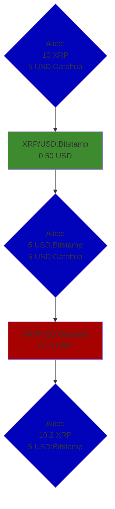
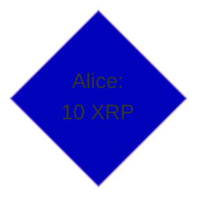
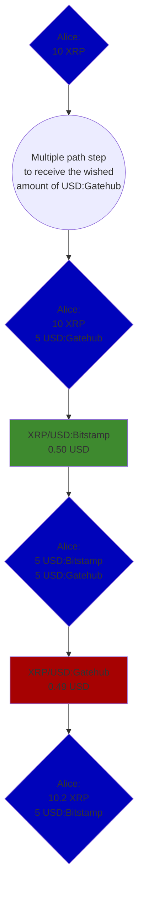
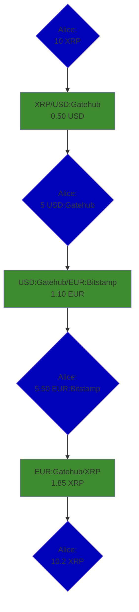

# xrpl-trading
A trading bot that performs arbitrage and market making on the XRP Ledger

## Concepts
1. Arbitrage
    - 1.1 Simple cross exchange arbitrage
    - 1.2 Triangular arbitrage
2. Market making

### 1. Arbitrage
Arbitrage trading describes the practice of taking advantage of differences in prices of the same assets in two or more markets.
In other words you are buying an asset in one market and at the same time you are selling the same asset at a higher price in a second market.

Often times arbitrageurs have prefunded multiple asstets on multiple exchanges to monitor as many possibilities for arbitrage opportunities as possible and to act as fast as possible. Arbitrageurs always have to make sure they've funded their assets they want to trade. If they don't have them funded they have to first buy the asset they want to spend which takes extra time and fees. Using the DeX and path finding of the XRP Ledger we can fund the wished asset, buy an asset and sell that asset with just a few transactions that all get validated in the same Ledger at the same time. So the arbitrage opportunity will be taken super fast and will cost, in the best case, a friction of a cent. Often times issuers have defined transfer fees that get charged whenever you are transfer a token, which increases the overall fees.

```
FT = FTxn + FTfr
```
- F<sub>T</sub>: Total fee
- F<sub>Txn</sub>: Transaction fee
- F<sub>Tfr</sub>: Transfer fee

On the XRPL we don't have multiple CeX but one DeX with multiple issuers of tokens. You can trade all tokens against each other. There are no limitations that you couldn't trade `USD:Bitstamp` against `USD:Gatehub` just because the issuers are different.

#### 1.1 Simple cross exchange arbitrage
This is the simplest type of arbitrage. We have Asset<sub>A</sub>, trade it against Asset<sub>B</sub> and trade Asset<sub>B</sub> for Asset<sub>C</sub>.

The flowchart below shows the potentially simplest example of a cross exchange arbitrage opportunity:

At the time `Alice` spot's the arbitrage opportunity, she hold's `10 XRP` and `5 USD` from the issuer `Gatehub` (`USD:Gatehub`). She spotted an offer that enables her to trade `10 XRP` at a price of `0.50 USD:Bitstamp` to receive `5 USD:Bitstamp`. She takes that trade because she also spotted an offer that enables hew to trade `5 USD:Gatehub` at a price of `0.49 USD:Gatehub` to receive `10.2 XRP`. After she consumes both offers, Alice still has `5 USD` (just the issuer changed), but now has `10.2 XRP`.
In this case, Alice whould need to send two `OfferCreate` transactions to consume the offers.

But what if Alice spotted the exact same arbitrage opportunity but had no `5 USD:Gatehub` funded?
According to this situation Alice's wallet would look like this:

Alice then looks if there is a payment path available that is efficient enough, so that the arbitrage opportunity is still profitable. If it is the example would look like something like this:


#### 1.2 Triangular arbitrage
This type of arbitrage is similar to the simple type of cross exchange arbitrage. As the name already suggest's, this type trades 3 assets against each other. This type has the advantage that we are monitoring more possibilities to find a profitable arbitrage opportunity.
Here is a simple example how a triangular opportunity could look like:


### Market making

---
## Setup
## Usage
